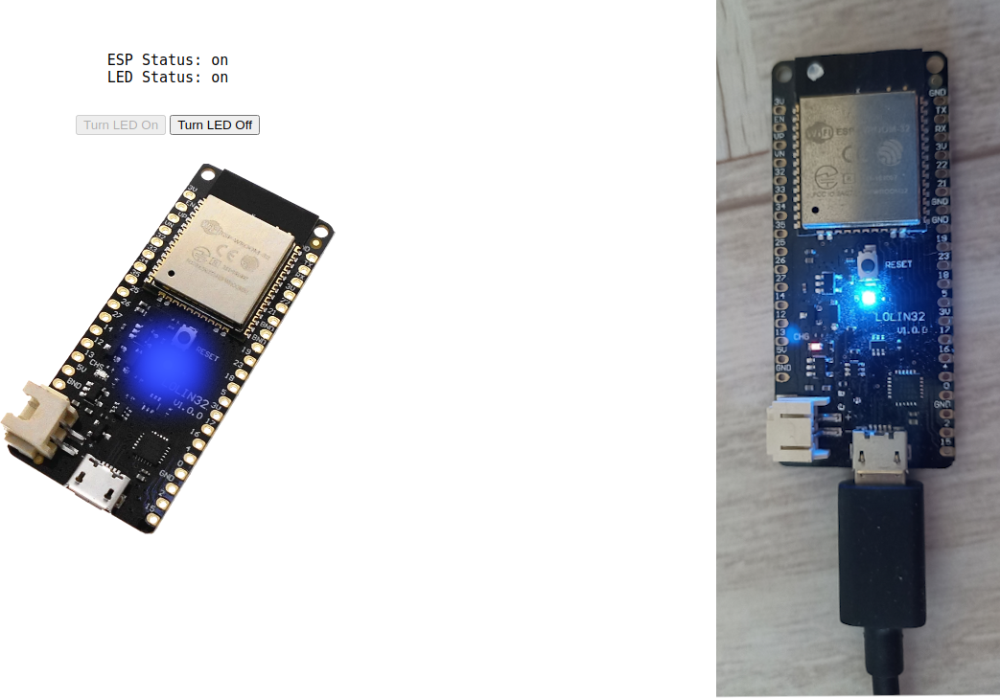

# Control Esp32 from a web panel over MQTT protocol

Simple web page with a Go backend to control an esp32 remotely throught [MQTT](https://mqtt.org/) protocol




## Installation

Firstly you need to edit the esp32/esp32.ino file filling this variables with your data:

```cpp
char WIFI_SSID[] = "";
char WIFI_PASS[] = "";
char MQTT_ADDR[] = "";
char MQTT_USER[] = "";
char MQTT_PASS[] = "";
```

Then you can upload this code to your ESP32 card.

Now we can build Go backend, simply run from your terminal to compile the project:

```bash
make
```

This generate the backend executable called `esp32-mqtt`.

## Usage

We need first to run the Mosquitto broker (follow installation instruction for your OS), run:

```bash
mosquitto
```

This starts an MQTT Broker on default port 1883.

If you have started the ESP32 you can see on serial port some debugging info like wifi connection and broker connection, in mosquitto terminal tab also you can see our client connection like something like this:

```bash
New connection from 127.0.0.1:61832 on port 1883.
New client connected from 127.0.0.1:61832 as esp32-client (p2, c1, k30).
```

Now we can start our backend, run:

```bash
./esp32-mqtt
```

You can run this command with `--help` flag to see other run options.

Now open web browser at <http://127.0.0.1:1234> and you can see our beautiful control panel.

If all goes right you can control you ESP32 Led from this page.

Have fun!